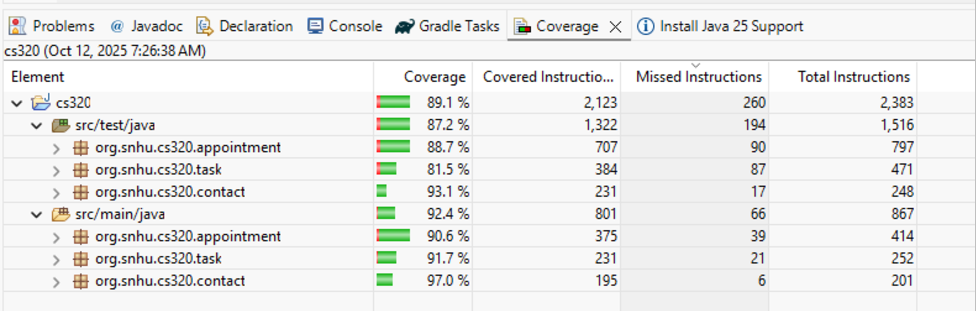
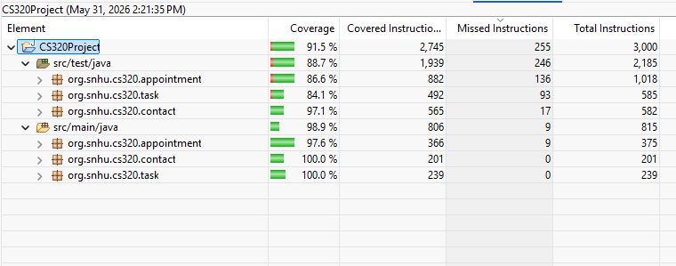
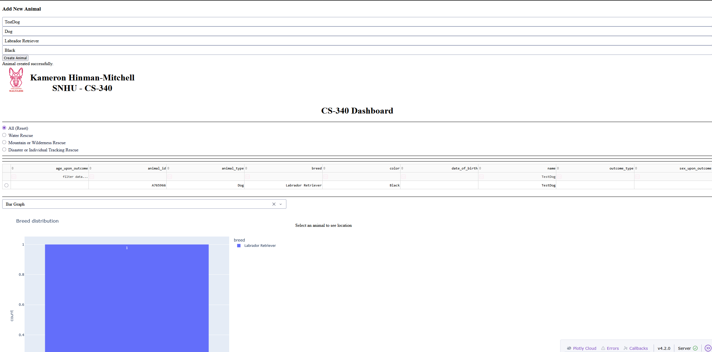
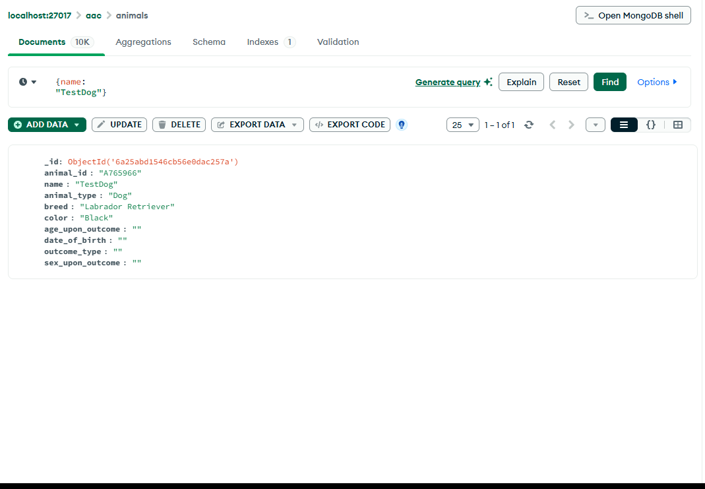

## CS-499 ePortfolio
June 2026

### Introduction

Hello, my name is Kameron Hinman-Mitchell and I have been in SNHU's Computer Science program since September 2024. This page is my ePortfolio for CS-499 Capstone and marks my completion of my Bachelor's degree in Computer Science.

### Professional Self Assessment

Completing the Computer Science Bachelors program has been a incredible growing experience, both academically and professionally. Over the course of the program, I have been able to refine the technical knowledge and skills essential to thrive in the computer science field. More importantly, I have gained a clearer understanding of my professional identity and career goals. This ePortfolio provided an opportunity to showcase what I have learned, highlight my technical competencies, and reflect on how my education has prepared me to contribute meaningfully in a professional setting.

Throughout my coursework, I engaged with a broad range of topics that collectively contributed to my development as a well-rounded software development professional. I have learned to approach problems systematically and efficiently while addressing real-world challenges. The projects that I have completed during my time at SNHU have allowed me to think critically and design scalable solutions, which are vital skills in software development and systems design. Working through the full software development life cycle, from requirements gathering from stakeholders to deployment, I have become comfortable with version control systems such as Git, collaborative development tools, and agile methodologies. One particularly impactful project was Artifact Three in this ePortfolio, where I created an system to view animal shelter records that would output animals that meet requirements of various rescues such as water, disater, and mountain rescues. The enhancement furthered my understanding of UI development and the importance of a robust backend that include multiple databases to support the application.

Cybersecurity has been a key focus area. Through hands-on practice and theoretical study, I have developed a solid foundation in secure coding practices. These skills are essential in today's technology landscape, where data breaches and system vulnerabilities can have serious consequences. By integrating security into each stage of development, I am confident in my ability to contribute to building systems that are both functional and secure.

Equally important to technical proficiency is the ability to collaborate effectively in a team environment. The program emphasized the importance of teamwork, effective communication, and stakeholder involvement. It is important to be able to communicate effectively with stakeholders- both technical and not. I learned how to translate complex technical concepts into language that is accessible and relevant to the intended audience. This skill is crucial in bridging the gap between the development teams and business stakeholders and ensuring that technology solutions align with organizational goals.

As I prepare to enter the next phase of my career, I feel confident in my readiness to contribute meaningfully in the field of computer science. This program has given me a strong technical foundation and reinforced my commitment to lifelong learning, problem-solving, and professional integrity.

In the following sections, you will find three examples of projects that I have completed in previous courses that I have improved using my skills in data structures, software engineering, and databases. You will find the projects both before and after the improvements as well as a thorough discussion of each artifact. These artifacts effectively showcase my skills that I have learned throughout my coursework at SNHU.

### Course Outcomes

In this ePortfolio I will demonstrate the following course outcomes:

- Employ strategies for building collaborative environments that enable diverse audiences to support organizational decision making in the field of computer science
- Design, develop, and deliver professional-quality oral, written, and visual communications that are coherent, technically sound, and appropriately adapted to specific audiences and contexts
- Design and evaluate computing solutions that solve a given problem using algorithmic principles and computer science practices and standards appropriate to its solution, while managing the trade-offs involved in design choices
- Demonstrate an ability to use well-founded and innovative techniques, skills, and tools in computing practices for the purpose of implementing computer solutions that deliver value and accomplish industry-specific goals
- Develop a security mindset that anticipates adversarial exploits in software architecture and designs to expose potential vulnerabilities, mitigate design flaws, and ensure privacy and enhanced security of data and resources

### Informal Code Review

The following code review contains all three artifacts shared in this portfolio. I go over each project separately discussing the existing functionality, any errors that will be corrected, and include what I plan to do to enhance the project.

#### [CS-499 Code Review](https://youtu.be/EAF5ywRZm4I)

### Enhancement One: Software Design and Engineering

This Artifact is a scene recreation featuring a cutting board with several items on top which was a digital watch, a power splitter, a wet wipe can and a Mechanical pencil all recreated in C++ using OpenGL. This artifact was originally created in December 2025 for a project in CS-330: Computational Graphics and Visualization. I included this project for my ePortfolio due to its visual distinction apart from other projects. As visual elements are not showcased much in other projects, this allows me to differentiate my showcase. OpenGL holds a dear spot in my heart as it is an important tool in creating video games and showing other visual focused projects. The main enhancement was further additions to the project as the original showcase was overtly simple. Adding further details to the digital watch and power splitter made them closer to what they originally represented. Additionally, more textures were added to make the objects more realistic. Although I am disappointed, I couldn’t further improve the wet wipes can, no matter what textures I thought of, they all just seemed as shotty as the original. The core concept of the project for this course was planned in the first module of the course and revisiting this project later with more experience helped improve it. Along with finishing the project I also completely redone the comments to further improve clarity of which of the objects belonged to which mesh.

View [Artifact One Original](https://github.com/KameronHinmanMitchell/CS-499-ComputerScienceCapstone/tree/main/Artifacts/Artifact%20One/OriginalArtifact1)

View [Artifact One Enhancement](https://github.com/KameronHinmanMitchell/CS-499-ComputerScienceCapstone/tree/main/Artifacts/Artifact%20One/Artifact1)

### Enhancement Two: Algorithms and Data Structures

This artifact is a JUnit test case of a CRUD Java application that interacts with a Contact, Appointment and Task creation system and validates the data entered and tests various functions. This artifact was originally started in September 2025 for a project in CS 320: Software Testing, Automation, and Quality Assurance. This artifact was chosen for my portfolio because proper testing of software is a crucial part of any application and is overall an important skill. Originally, I had several issues with the testing portion on coming up with test cases and the logic of JUnit testing as a whole. This left me to redo a lot of the software tests which give me a great opportunity to better my skill.

My plan was to increase the complexity of the application and tests, with the goal of increasing coverage and filling in the gaps in test cases, ensuring that the application was thoroughly tested. The achieve this I reviewed each java class along with the associated test class and identified gaps in the testing. While originally the tests covered the essential operations of CRUD, there were several edge-cases that could be expanded upon. The increase in complexity also increased the overall instructions and covering those increased overall complexity. In the end, my overall coverage increased from 89.1% to 91.5%, not a great increase, but is significate when seeing the overall complexity increase on the classes themselves.

#### Before

#### After

View [Artifact Two Original](https://github.com/KameronHinmanMitchell/CS-499-ComputerScienceCapstone/tree/main/Artifacts/Artifact%20Two/Artifact2Original/Project_1_KameronHinmanMitchell)

View [Artifact Two Enhancement](https://github.com/KameronHinmanMitchell/CS-499-ComputerScienceCapstone/tree/main/Artifacts/Artifact%20Two/Artifact2)

### Enhancement Three: Databases

This artifact is a project that utilizes a MongoDB database populated by animal shelter records and outputs this data to a dashboard format that can filter data, view a map contain the locations of the animals and search for animals that meet requirements of various rescues such as Water, disaster and mountain rescues, This artifact was created in December 2025 for CS-340: Advanced Programming Concepts. This artifact was chosen because of the interactions with the database and the ability to search through it was limited and could be improved upon. To do this, I added a search function and enhanced the UI by giving the user the ability to add records through the dashboard itself. 

View [Artifact Three Original](https://github.com/KameronHinmanMitchell/CS-499-ComputerScienceCapstone/tree/main/Artifacts/Artifact%20Three/OriginalArtifact3)

View [Artifact Three Enhancement](https://github.com/KameronHinmanMitchell/CS-499-ComputerScienceCapstone/tree/main/Artifacts/Artifact%20Three/Artifact3)

## Contact

Github: [https://github.com/KameronHinmanMitchell](https://github.com/KameronHinmanMitchell)

